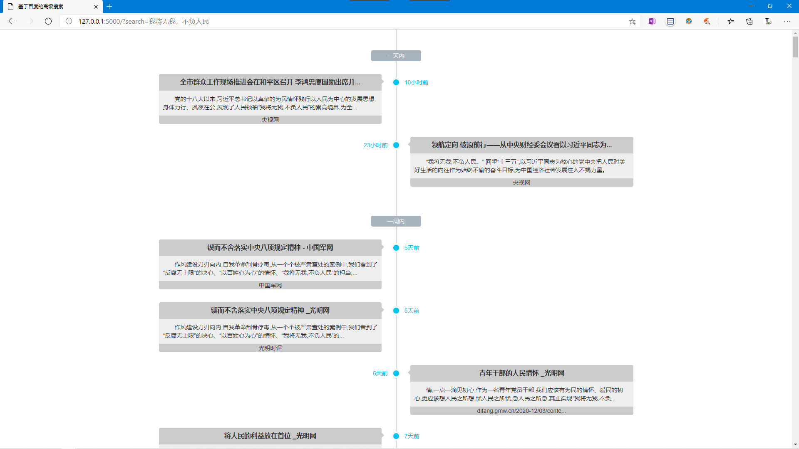

# SafeSearch

## 简介

**本项目用于一次性在多个指定网站群组内完成搜索。** 实际上是对`site`高级搜索关键字的功能增强，能够有效的对大量网站进行同步的搜索。

## 使用

 - 在线使用: [http://search.loopy.tech](http://search.loopy.tech)
 - 本地使用：先下载，使用`python setup.py install`安装，然后直接运行`web.py`（浏览器使用）或`main.py`（命令行使用）
 - 高阶使用：注释得比较清晰，读注释自己接函数进来就可以了。同时，你可以修改`sites.yaml`来自定义网站群组（**目前只支持了中国的官方媒体**）
 
 
 
## 依赖

本项目基于百度搜索（使用[`BaiduSpider`](https://github.com/BaiduSpider/BaiduSpider) 进行爬取）
